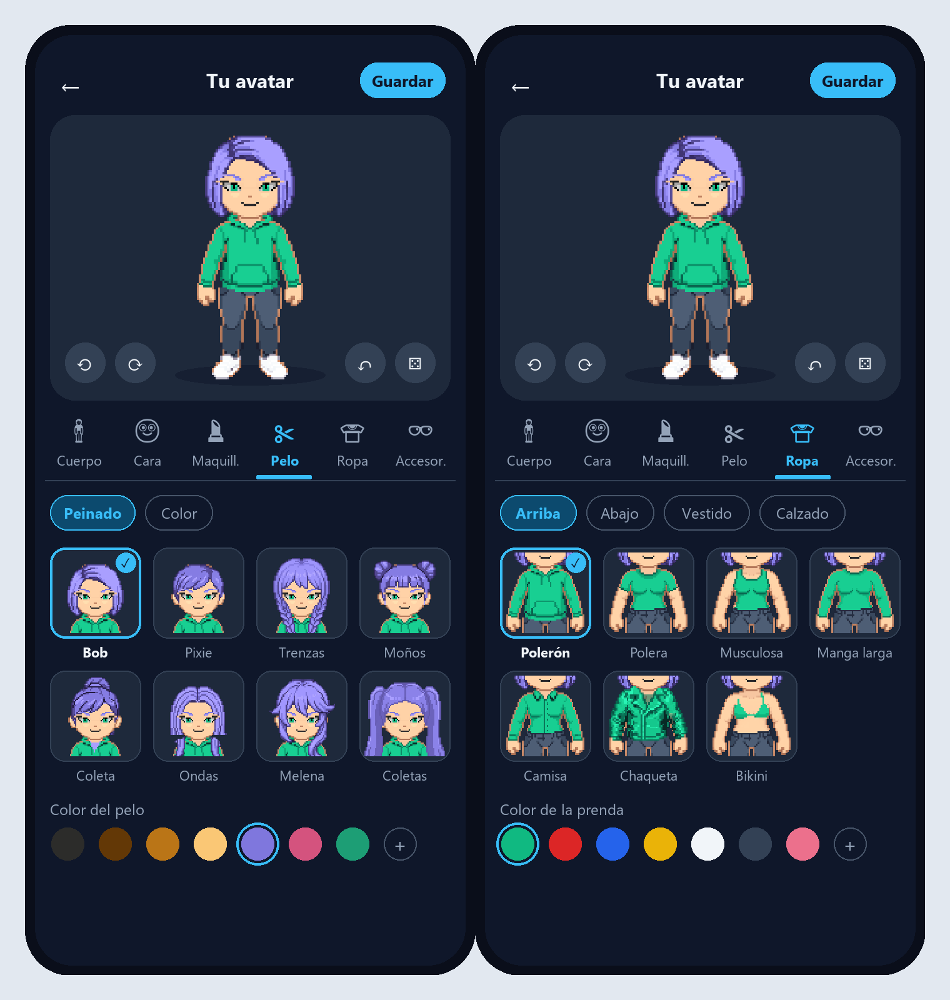

# Plan: Rediseño del editor de personaje

Objetivo: un solo editor de avatar para el registro y para la sala, con miniaturas del propio
avatar en vez de listas de nombres, seis pestañas (Cuerpo / Cara / Maquillaje / Pelo / Ropa /
Accesorios) y el perfil de citas en su propia pantalla.

## 0. Decisiones (2026-10-06)

| Tema | Decisión |
|---|---|
| Layout móvil | **A**: vista previa fija arriba (~30 % de la altura), pestañas con ícono, píldoras de subcategoría, cuadrícula de 4 columnas y fila de colores |
| Perfil de citas | Pantalla aparte, **Mi perfil** (fotos, bio, intención, distancia, gustos, estilo de vida) |
| Miniaturas | El propio avatar con el ítem puesto, recortado según la categoría; con caché y repintado al cambiar la piel o los colores |
| Registro | Editor completo (6 pestañas) + botones Aleatorio y Saltar, en el paso 2 del asistente actual |
| Marcas | Todas (de cara y de cuerpo) van en **Cuerpo** |
| Cejas | En **Cara** |
| Guardado en la sala | Borrador + botón Guardar + diálogo "¿Descartar cambios?" al salir + deshacer |
| Bloqueos/pago | No por ahora; la miniatura solo deja un espacio opcional para una insignia |

### Pestañas y subcategorías

| Pestaña | Subcategorías (píldoras) | Recorte de miniatura |
|---|---|---|
| Cuerpo | Complexión*, Piel, Marcas (multi) | cuerpo entero / torso |
| Cara | Forma, Ojos (+ color), Cejas (+ color), Nariz, Boca | cara |
| Maquillaje | Rubor, Sombra, Delineado, Labial (cada uno con su color) | cara |
| Pelo | Peinado (+ color) | cabeza (con el pelo largo incluido) |
| Ropa | Arriba, Abajo, Vestido, Calzado (cada uno con su color) | torso / piernas / pies |
| Accesorios | Bolso, Lentes, Cintillo, Sombrero (uno por espacio) | cabeza / torso |

\* Complexión bloqueada para MAN y WOMAN, igual que hoy (`AvatarConfig.restrictedTo`).
Cuando una pestaña tiene una sola subcategoría, no se muestran píldoras.
La vista previa se acerca a la cara (`CharacterPreviewGame.setFaceFocus`) en Cara, Maquillaje
y Pelo, y muestra el cuerpo entero en Cuerpo, Ropa y Accesorios.

## 1. Estado actual

- `features/auth/screens/fun_registration_wizard.dart` (~1860 líneas): el paso 2 tiene su propia
  copia de `_buildHairTab`, `_buildTopClothingTab`, `_buildOptionList`, `_buildColorPalette`…
- `features/avatar/screens/character_creator_screen.dart` (~3500 líneas): abierto desde
  `cozy_lobby_view.dart` (`_openWardrobe`, con `initialMode: 1` para el perfil). Mezcla el editor
  de avatar (las mismas pestañas duplicadas) con el perfil de citas.
- Solo comparten `CharacterPreviewGame`, `AvatarCatalog` y `AvatarConfig`.
- `ModularAvatarComponent.reloadSprites()` carga 8 direcciones × 5 cuadros por config. Hacer eso
  para cada miniatura sería demasiado costoso, así que hace falta un camino de "un solo cuadro".

## 2. Fases

Cada fase deja la app funcionando y se puede commitear por separado.

### Fase 1 — Pintado de avatar reutilizable

- Extraer de `ModularAvatarComponent.render` un pintor puro, `AvatarLayerPainter.paint(canvas,
  rect, config, layers)`, con el mismo orden de capas y los mismos tintes (`BlendMode.modulate`).
  El componente lo sigue usando, así que no cambia nada visible.
- Separar del bucle de `reloadSprites` una función `loadFrameLayers(config, frameKey)` que carga
  las capas de **un** cuadro (incluidos los ojos y la boca recoloreados por `face_makeup.dart`).
  Se sigue cargando con `rootBundle`/`_loadSprite`, nunca con `Flame.images` (los tests se cuelgan).
- Tests: los `avatar_*_render_test.dart` existentes deben seguir pasando sin cambios.

### Fase 2 — Servicio de miniaturas

- `AvatarThumbnailService` (en `features/avatar/services/`):
  `Future<ui.Image> thumbnail(AvatarConfig base, String slot, String itemId, ThumbCrop crop)`.
  - Aplica el ítem sobre `base`, carga el cuadro frontal en reposo (dirección 1), pinta con
    `PictureRecorder` y recorta con `ThumbCrop` (`face`, `head`, `torso`, `legs`, `feet`, `full`).
    Los rectángulos de recorte son constantes sobre el lienzo de 64×128.
  - Clave de caché = la config con el ítem puesto, sin los campos que solo se dibujan fuera del
    recorte (`AvatarThumbnailService.relevant`, según las filas que usa el arte). Así, cambiar los
    zapatos o el pantalón no repinta los peinados, y cambiar los ojos o la polera no repinta los
    zapatos. El cuello de la polera sí se ve en el recorte de cabeza. Un test comprueba, ítem por
    ítem del catálogo, que esto no cambia ningún píxel dentro del recorte.
  - LRU de ~200 imágenes y una cola con como máximo 3 renders a la vez. Solo se pide lo visible
    (pestaña y píldora activas).
- Pintado sin suavizado (`FilterQuality.none`) para mantener el pixel art nítido.
- Tests: la miniatura no sale vacía; cambiar la piel invalida la caché y cambiar los zapatos no
  invalida las miniaturas de `hair`.

### Fase 3 — Controlador y descripción de pestañas

- `AvatarEditorController` (`ChangeNotifier`): `config`, `gender`, pila de deshacer (máx. 30),
  `isDirty`, `randomize()` (solo con ítems que `restrictedTo` permite) y `apply(slot, value)`, que
  siempre pasa por `restrictedTo(gender)`.
- `editor_tabs.dart`: las pestañas y subcategorías como **datos** (`EditorTab` → `EditorSection`
  con slot, recorte, paleta de color, si es opcional y si es múltiple). Los ítems se leen de
  `AvatarCatalog.items`. Piel, forma de cara y complexión son secciones especiales (muestras de
  color o selector) porque no son `AvatarItem`.
- Añadir un ítem nuevo al catálogo = aparece solo en el editor, sin tocar la UI.
- Tests: deshacer, `isDirty`, que aleatorio respete el género y que todo slot del catálogo
  aparezca en alguna sección.

### Fase 4 — Widgets del editor

- `AvatarItemPicker`: cuadrícula de 4 columnas con miniatura y nombre corto, marca de
  seleccionado y una casilla "Ninguno" para los slots opcionales. Permite selección múltiple para
  las marcas y tiene un espacio opcional para una insignia (sin lógica).
- `AvatarColorRow`: muestras de la paleta del slot + un botón "+" para un color libre.
- `AvatarEditor`: vista previa (`CharacterPreviewGame` con girar, caminar, deshacer y aleatorio)
  + pestañas + píldoras + picker + colores. Recibe un `AvatarEditorController` y no sabe si está
  en el registro o en la sala.
- Nombres de los ítems: hoy las etiquetas llevan emoji y texto largo ("Ojos Felinos 🐱"). Se
  agrega `AvatarItem.shortLabel` (opcional, con la etiqueta actual como respaldo) para la
  cuadrícula.

### Fase 5 — Registro

- Reemplazar `_buildStep2Avatar` y todos sus `_build*Tab` en `fun_registration_wizard.dart` por
  `AvatarEditor`. El género del paso 1 se pasa al controlador.
- El paso 2 tiene "Aleatorio" y "Saltar" (que deja el avatar por defecto, ya ajustado al
  género). "Siguiente" hace las veces de guardar.
- Borrar el código duplicado (~900 líneas).
- Tests: `auth_and_persistence_test.dart` y `avatar_customizer_test.dart` cambian al nuevo widget.

### Fase 6 — Sala: `AvatarEditorScreen`

- Pantalla nueva que envuelve `AvatarEditor` con una barra superior (atrás + Guardar) y un
  `PopScope` que, si `isDirty`, pregunta "¿Descartar cambios?".
- `cozy_lobby_view._openWardrobe` abre esta pantalla; el `onSaved` actual
  (`AvatarStorageService.saveUserConfig`, `AuthService.saveAvatarConfig`, actualizar la sala) no
  cambia.

### Fase 7 — Mi perfil aparte

- Mover las secciones de perfil de `character_creator_screen.dart` (foto oficial y verificación,
  galería, bio, distancia, estilo de vida, gustos y vista previa) a
  `features/profile/screens/dating_profile_screen.dart`, con el mismo esquema de borrador y
  Guardar.
- En la sala, el acceso que hoy usa `_openWardrobe(initialMode: 1)` abre `DatingProfileScreen`.
- Borrar `character_creator_screen.dart`.
- Tests: `dating_profile_preview_test.dart` pasa a la pantalla nueva.

### Fase 8 — Cierre

- `flutter analyze` y `flutter test` en verde.
- Probar en un emulador: tiempo de la primera carga de una pestaña llena (objetivo: < 300 ms
  hasta ver las miniaturas) y memoria con la caché llena.
- Actualizar `CLAUDE.md` (sección Avatar) y la memoria del proyecto.

## 3. Riesgos

- **Costo de las miniaturas**: los ojos y la boca se recolorean píxel a píxel (`toByteData`). La
  pestaña Cara con 11 ojos × colores puede tardar. Mitigación: cola, caché por campos relevantes
  y mostrar las casillas con un marcador mientras cargan.
- **Pelo largo en el recorte de cabeza**: algunos peinados (coletas, ondas) se salen del recorte.
  Mitigación: un recorte `head` más alto; se puede ajustar por ítem si hace falta.
- **Prendas que tapan otras**: la miniatura de "Abajo" con un vestido puesto no mostraría nada.
  Regla: al pintar las miniaturas de un slot, se quitan las piezas que lo ocultan (el vestido al
  mostrar "Arriba"/"Abajo").
- **Tamaño del cambio**: se borran ~3000 líneas duplicadas. Por eso las fases 5–7 van en commits
  separados y cada una con sus tests.
