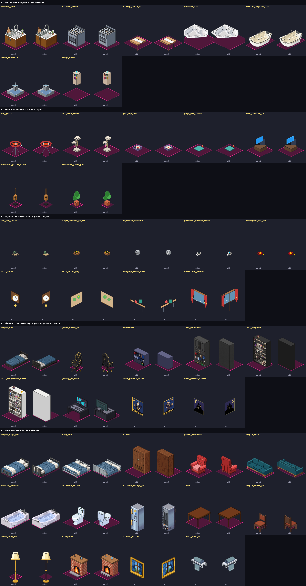

# Auditoría de muebles (2026-10-09)

Primer paso de la fase 3 de `room-art-plan.md`: antes de hacer muebles nuevos por estilo, revisar los
62 del catálogo y decidir qué se arregla, qué se rehace y qué se retira.

## Cómo se hizo (repetible, sin créditos)

- `frontend/test/furniture_audit_tool_test.dart`: el propio juego pone cada mueble en un cuarto vacío
  en sus 4 rotaciones (rot0 arriba, rot1 derecha, rot2 izquierda, rot3 abajo; los de pared en norte,
  oeste y norte alto) y dibuja encima el contorno de su huella. Se salta en la suite normal:
  `AUDIT_DIR=<carpeta> flutter test test/furniture_audit_tool_test.dart` (`AUDIT_ONLY=id,id` para
  unos pocos).
- `CreateSprites/furniture_gen/audit_files.py <carpeta>/_meta.tsv`: revisa los archivos (rotaciones
  que faltan, vista trasera, espejos, píxel al doble, contorno negro puro).
- Cobertura de la huella: cuánto del ancho del rombo cubre el dibujo y a cuántos píxeles queda su
  base del vértice inferior (con la misma geometría que el juego; los cubos guía dan 100 % y 0 px).

## Hallazgos

### A. Huella mal ocupada o mal ubicada

| Mueble | Medida | Qué pasa |
|---|---|---|
| `kitchen_sink` | 81 % del ancho, base 9 px arriba | El mueble no llega a los bordes de la casilla: entre dos muebles de cocina queda un hueco. |
| `kitchen_stove` | 66 %, base 13 px arriba | Igual, más angosta todavía. |
| `dining_table_2x2` | 57 %, 8 px abajo | Tablero chico flotando sobre patas sueltas; no llena el 2×2. |
| `bathtub_2x2` | lienzo 192 (debería ser 256), 75 px arriba | Lienzo de 1×2 en un mueble 2×2: queda corrida y flotando. rot1 no es espejo. |
| `bathtub_regular_1x2` | 81 %, 20 px arriba | Más chica que la casilla y corrida. |
| `stone_fountain` | 60 %, 29 px arriba | Chica para su 2×2 y muy simple. |
| `manga_shelf` | 32 %, 75 px arriba | Flota muy por encima de su casilla (lienzo y offset de otro tamaño). |

Los muebles que van contra la pared (armario, estanterías, inodoro) cubren 50–65 % del ancho a
propósito: son poco profundos. No es un error.

### B. Arte sin terminar o muy simple

`bbq_grill`, `cat_tree_tower`, `pet_dog_bed`, `yoga_mat_floor`, `home_theater_tv`,
`acoustic_guitar_stand` (la guitarra flota sobre la base) y `monstera_plant_pot` (bolas verdes
sobre un cubo). Son dibujos de pocos colores, sin el detalle ni el sombreado del resto, y ninguno
tiene vista trasera.

### C. Objetos de superficie y de pared flojos

`tea_set_table`, `vinyl_record_player`, `espresso_machine`, `polaroid_camera_table`,
`boardgame_box_set` (muy chicos y planos), `wall_clock`, `wall_world_map` (un cartón con dos
puntos verdes), `hanging_shelf_wall` (una tabla con dos figuras) y `curtained_window` (la barra de
la cortina baja hasta el suelo).

### D. Técnico

- **Contorno negro puro** (el resto usa contorno selectivo): `single_bed` (10 %), `gamer_chair_sm`
  (23 %), `vinyl_record_player` (11 %), `bookshelf`, `tall_bookshelf`, `tall_mangashelf`,
  `gaming_pc_desk`, `wall_poster_anime(2)`, `wall_poster_cinema` (39 %). Se arregla gratis con
  `convert_selout.py --scenery`.
- **Píxel al doble** (dibujado con píxeles de 2×2, mitad de densidad): `tall_mangashelf`,
  `tall_mangashelf_white` y los cubos guía (estos no importan, son herramientas).
- **Sin vista trasera** (rot2 = rot0): casi todos los muebles salvo camas, sillas, sillones,
  armario, estanterías, refrigerador, inodoro y sofá. En simétricos (mesa, lámpara, planta) da
  igual; en los que tienen frente (cocina, fregadero, TV, chimenea) al girarlos 180° siguen
  mirando hacia la cámara.

### E. Bien (sirven de referencia)

`single_high_bed`, `king_bed`, `closet`, `plush_armchair`, `simple_sofa`, `bathtub_classic`,
`bathroom_toilet`, `kitchen_fridge_sm`, `table`, `simple_chair_sm`, `side_table_sm`,
`floor_lamp_sm`, `floor_plant_sm`, `fireplace`, `window_yellow`, `towel_rack_wall`,
`pan_rack_wall`, `art_painting`, los pósters, `coffee_mug`, `table_lamp`, `open_book`, `lava_lamp`.

### Duplicados

| Grupo | Situación |
|---|---|
| `single_bed` / `single_high_bed` | El cuarto inicial ya usa la alta. La baja tiene contorno negro y peor arte. |
| `bathtub_classic` / `bathtub_regular_1x2` / `bathtub_2x2` | La clásica está bien; las otras dos tienen la huella mal. |
| `manga_shelf` / `tall_mangashelf` / `tall_mangashelf_white` | La baja flota; las altas están a media densidad. |
| `bookshelf` / `tall_bookshelf` | Distintas alturas, las dos sirven (solo contorno). |

## Decisiones pendientes

1. Qué hacer con cada duplicado: arreglar, o retirar y que su id apunte al bueno (los cuartos
   guardados que lo usen siguen funcionando).
2. Vista trasera: hacerla solo para muebles con frente (cocina, fregadero, TV, chimenea, escritorio)
   al rehacerlos, o para todos.
3. Orden de las tandas: cuarto inicial (fregadero, cocina, camas, bañeras) → piezas de estilo (té,
   tocadiscos, estantería manga, monstera, cama de perro, yoga) → el resto.
