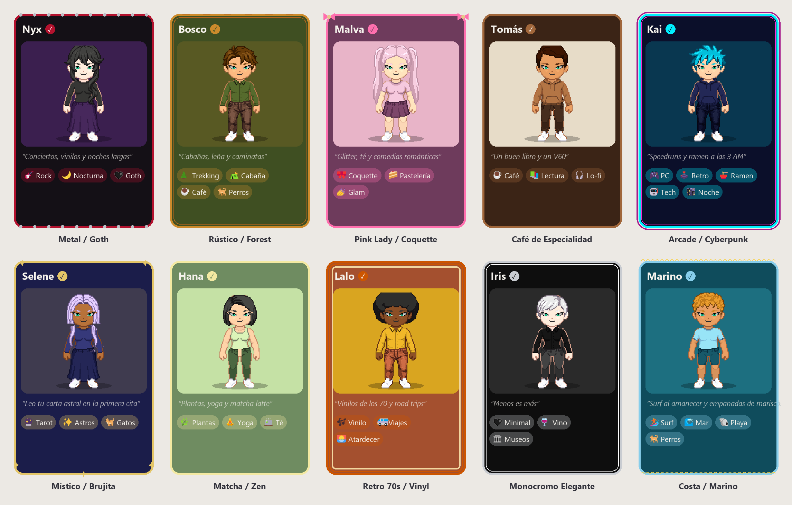
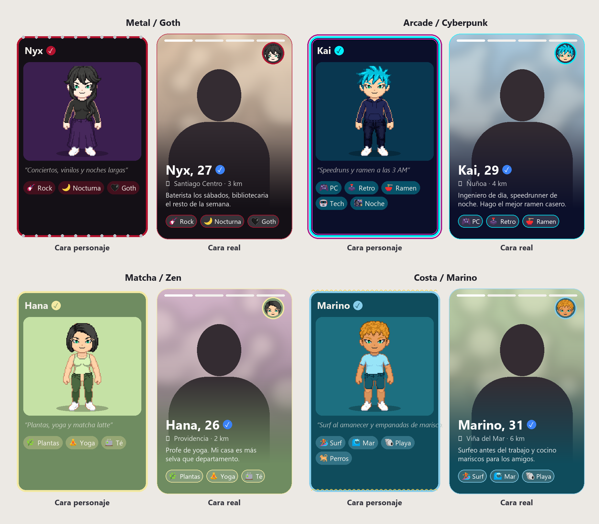
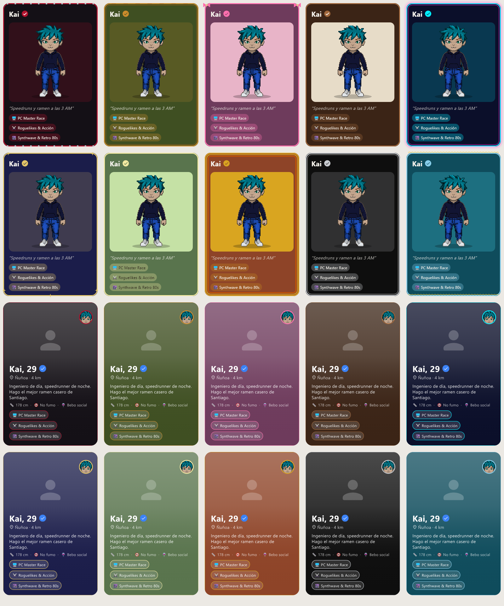
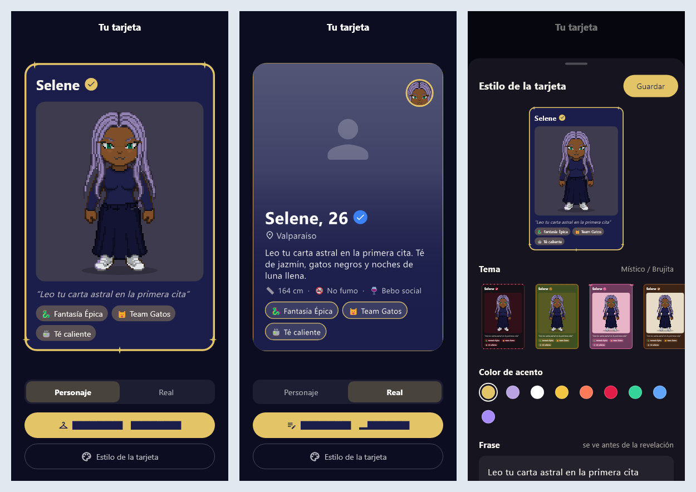
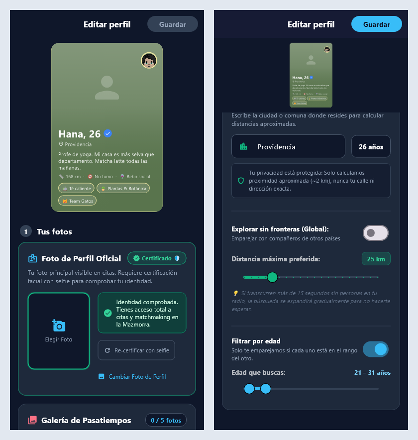
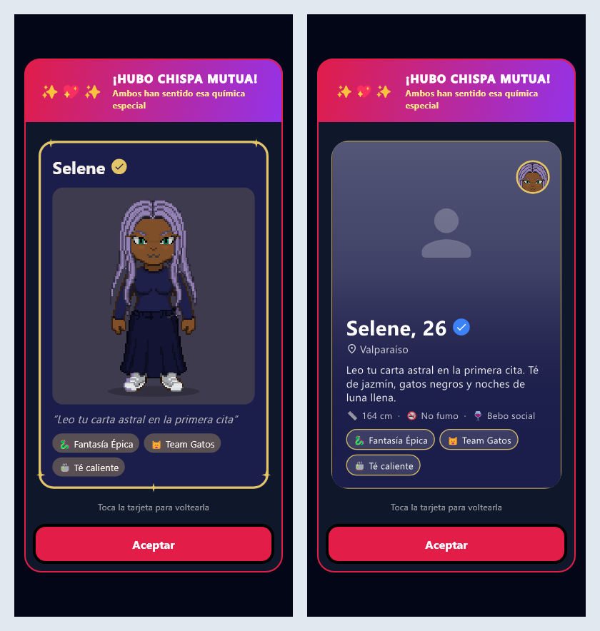

# Plan: Tarjeta de perfil de dos caras

Objetivo: que el avatar y el perfil real se sientan como **una sola tarjeta con dos caras**. La
cara personaje es lo que ve la otra persona antes de la fogata; en la revelación la tarjeta se
voltea a la cara real. Desde la sala, la tarjeta es también el menú para editar cada cara, y su
estilo se puede personalizar. Este plan absorbe la fase 7 del plan del editor de personaje: sacar
el perfil de `character_creator_screen.dart` y borrar ese archivo.

## 0. Decisiones (2026-10-06)

| Tema | Decisión |
|---|---|
| Menú desde la sala | **Una tarjeta que se voltea** con selector Personaje / Real; el botón de editar sigue a la cara visible ("Editar avatar" / "Editar perfil"), más "Estilo de la tarjeta". Reemplaza el menú de dos opciones de la fase 6 del plan anterior. |
| Editar la cara real | **Sobre la tarjeta**: la tarjeta arriba (en vivo) y debajo todas las opciones, en este orden: 1. foto oficial + otras fotos + galería de pasatiempos (viajes, hobbies, mascotas); 2. Acerca de mí; 3. Quién eres y cómo es tu realidad de vida (insignias); 4. Vibes y gustos; 5. Qué sexo buscas conocer; 6. Distancia de búsqueda y filtro de edad. |
| Cara personaje | Avatar, nombre de usuario, insignia de certificación, **frase corta** (máx. 60 caracteres) y **gustos destacados**. Sin edad, comuna ni intención (se revelan después). |
| Gustos destacados | **1 a 5**, a elección. |
| Estilo | **Temas armados + color de acento** (10 temas, abajo). |
| Lenguaje de cada cara | La cara personaje se siente **juego** (pixel art, marco con adornos del tema). La cara real se siente **app de citas** (estilo Tinder): conserva los colores del tema pero cambia el lenguaje, ver abajo. |
| Quién la ve | **Cara personaje antes de la fogata** (emparejamiento, presentación de la partida, campamento); **se voltea a la real en la revelación**. |
| Filtro de edad | Nuevo. **Sin filtro por defecto**; si se ajusta, cuenta **en ambos sentidos** en el emparejamiento (cada uno debe caer en el rango del otro), como el género buscado. |

### Temas

| Tema | Base | Acentos | Ambiente |
|---|---|---|---|
| Metal / Goth | negro carbón, púrpura espectral | carmesí, plata | cuero, rock, noche |
| Rústico / Forest | verde musgo, marrón corteza | ocre, arcilla | naturaleza, cabaña |
| Pink Lady / Coquette | malva oscuro, rosa empolvado | rosa chicle, dorado champaña | dulce, glam |
| Café de Especialidad | marrón espresso, beige avena | toffee, caramelo | minimalista, libros, lofi |
| Arcade / Cyberpunk | azul noche abisal | cyan neón, magenta | gamer, tech, retro |
| Místico / Brujita | azul medianoche aterciopelado | dorado lunar, lavanda | tarot, constelaciones |
| Matcha / Zen | verde té savia | pistacho claro, amarillo suave | plantas, calma, bienestar |
| Retro 70s / Vinyl | terracota tostado | mostaza, naranja quemado | vintage, análogo, atardecer |
| Monocromo Elegante | negro azabache | gris platino, blanco puro | sobrio, moderno, formal |
| Costa / Marino | azul petróleo profundo | azul cielo, amarillo faro | mar, brisa, salitre |

### Mismo tema, dos lenguajes

| | Cara personaje (juego) | Cara real (app de citas) |
|---|---|---|
| Protagonista | el avatar en pixel art sobre un panel | la foto a sangre, en toda la tarjeta, con barras de progreso arriba |
| Marco | adornos del tema (tachas, moños, estrellas…) | sin adornos: borde fino del color de acento, esquinas más redondeadas |
| Texto | sobre el fondo plano del tema | sobre un degradado del color base del tema en la mitad inferior de la foto |
| Tipografía | lúdica | limpia y moderna; nombre y edad grandes |
| Gustos | chips llenos del acento | chips translúcidos con borde de acento |
| Avatar | protagonista | sello redondo pequeño en una esquina (la misma persona) |

Cada tema trae su marco (tachas, madera, moños, neón, estrellas, franjas, cuerda...) y sus acentos
sugeridos; el color de acento se elige entre los del tema y una paleta corta común. Los marcos se
dibujan primero en código (`CustomPainter`, como en el boceto); pasarlos a sprites de pixel art con
outline selectivo queda como mejora posterior.

## 1. Estado actual

- **Perfil**: se edita en el modo perfil de `features/avatar/screens/character_creator_screen.dart`
  (~3500 líneas), con secciones `_buildOfficialPhotoAndVerificationSection`,
  `_buildHobbyGallerySection`, `_buildBioSection`, `_buildDistanceAndLocationSection` (incluye qué
  género buscas), `_buildLifestyleBadgesSection`, `_buildTastesSection`. Desde la sala se llega por
  "Tu perfil de citas" (menú de la tarjeta) o por "Certificar ahora".
- **Revelación**: `features/revelation/screens/match_reveal_celebration_view.dart` (851 líneas)
  muestra fotos, bio e insignias, sin avatar. Se abre desde la sala y el buzón con los datos de una
  `MailboxLetter`.
- **Antes de la fogata**: el servidor manda `partnerUsername` y `partnerAvatarConfig` al iniciar la
  partida (`GameSessionService`); `dungeon_match_intro_view.dart` y el campamento los usan.
- **Backend**: el perfil vive en la tabla `users`, con columnas JSON `LONGTEXT` agregadas con
  `ALTER TABLE` al arrancar (así llegó `lifestyle`); se guarda por `POST /auth/profile`.
  `MatchmakingService` ya filtra por género buscado y distancia.

## 2. Fases

Cada fase deja la app funcionando y va en su propio commit.

### Fase 1 — Datos de la tarjeta (cliente y servidor) — hecha

- `ProfileCardStyle` (`core/models/profile_card_style.dart`): `themeId`, `accent` (null = el del
  tema), `phrase` (≤ 60 caracteres visibles, espacios colapsados) y `featuredTastes` (1-5, nunca la
  intención). `defaultFor(tastes)` sugiere el tema por los gustos (`themeHints`; empate → el que va
  antes; ninguno → Café) y destaca los 3 primeros gustos; `normalizedFor(tastes)` lo mantiene
  válido si cambian los gustos. Lectura tolerante a datos rotos.
- `UserProfile`: `cardStyle` (null hasta que la persona elige; `effectiveCardStyle` da el que se
  muestra), `seekingAgeMin` / `seekingAgeMax` (null = sin límite) con `withSeekingAgeRange`.
- **La bio ahora se guarda en el servidor.** Hasta hoy solo vivía en memoria del teléfono: se
  perdía al cerrar la app y la otra persona veía una bio genérica en la revelación.
- Backend: columnas `bio TEXT`, `card_style LONGTEXT`, `seeking_age_min INT NULL`,
  `seeking_age_max INT NULL` (patrón `ALTER TABLE` al arrancar). `POST /auth/profile` y el registro
  las aceptan: bio recortada a 180; edades limitadas a 18-99 y ordenadas; `null` borra el filtro.
  Las respuestas de login, registro y perfil las devuelven.
- `AuthService.saveProfileToBackend` envía bio, estilo y rango (el rango siempre, para poder
  borrarlo) y conserva la intención local al leer la respuesta (el servidor no la guarda).
- Tests: `profile_card_style_test.dart` (8) y 2 tests nuevos en `AuthAndRoomPersistenceTests`.

### Fase 2 — Emparejamiento por edad — hecha

- `MatchmakingService`: cada jugador debe caer en el rango de edad del otro, si lo tiene
  (`isAgeCompatible`, límites inclusivos). La edad y el rango se leen de la base al entrar a la cola
  (son preferencias guardadas, no vienen en el mensaje de conexión). Edad desconocida (0) pasa
  cualquier filtro; sin rango no se filtra.
- Tests: sin filtro empareja cualquier edad; filtro recíproco (Alice acepta a David, pero David no
  a Alice → no se emparejan; David y Bob sí); compatibles en ambos sentidos; casos de borde.

### Fase 3 — Catálogo de temas y widget `ProfileCard` — hecha

- `features/profile/card/card_themes.dart`: los 10 temas (`ProfileCardTheme`: base, panel del
  avatar, acentos sugeridos, marco) y una paleta común de acentos. El color de texto se elige por
  contraste (oscuro o claro, el que se lea mejor) y el relleno de los chips toma menos acento si
  hace falta. Matcha y Retro 70s quedaron un poco más oscuros que en el boceto para que el texto
  llegue a 4,5:1.
- `card_frame_painter.dart`: los adornos de cada marco (tachas, madera, moños, neón, estrellas,
  franjas, línea fina, cuerda).
- `profile_card.dart`: `ProfileCard(profile, style?, showReal, distanceKm?)`. Se dibuja a un
  tamaño de diseño fijo (300×454) y se escala, así se ve igual en cualquier pantalla; el texto del
  sistema se limita a ×1,15 dentro de la tarjeta. Giro en Y de 650 ms.
  - Cara personaje: nombre + sello de certificación del color de acento, avatar en pixel art,
    frase, gustos destacados (título corto: `PreferenceCatalog.shortTitle`).
  - Cara real: foto a sangre con barras de progreso y toques a los lados, degradado del color
    base, nombre y edad, comuna · distancia, bio (3 líneas), hasta 3 insignias, 3 gustos en chips
    translúcidos, sello con la cabeza del avatar. Sin fotos, una silueta sobre el degradado.
- `avatar/widgets/avatar_still_image.dart`: el avatar quieto como imagen nítida, con caché.
- Tests (`profile_card_test.dart`): contraste de cada tema con cada acento; ambas caras en los 10
  temas y el giro; contenido al máximo en un teléfono chico con texto grande; sin fotos.

### Fase 4 — "Tu tarjeta": el menú desde la sala — hecha

- `features/profile/screens/my_card_screen.dart` (`MyCardScreen`): la tarjeta grande sobre un
  fondo del color del tema; se voltea con el selector Personaje / Real, tocándola o deslizando de
  lado. Botón principal "Editar avatar" / "Editar perfil" según la cara (del color de acento) y
  "Estilo de la tarjeta". Recibe el perfil y las acciones de edición desde la sala.
- `features/profile/widgets/card_style_sheet.dart`: hoja con vista previa en vivo de la cara
  personaje; tema (miniaturas de tu propia tarjeta; cambiar de tema vuelve a su acento), color de
  acento (los del tema + paleta común), frase (máx. 60) y gustos destacados (1 a 5, sin la
  intención). Se guarda con "Guardar"; cerrarla descarta.
- `AuthService.updateCardStyle`: guarda en sesión y en el servidor. Si falla, el estilo se ve en
  este teléfono y se avisa.
- Sala: la tarjeta de perfil abre `MyCardScreen` (reemplaza el menú de dos opciones); el armario
  sigue abriendo el editor de avatar; "Certificar ahora" abre el perfil (pantalla vieja hasta la
  fase 5).
- Tests: `my_card_screen_test.dart` (giro y botones, guardar estilo, límites de destacados, fallo
  al guardar, cerrar sin guardar) y el de la sala actualizado.

### Fase 5 — "Editar perfil" sobre la tarjeta — hecha

- `features/profile/screens/edit_profile_screen.dart` (`EditProfileScreen(avatarConfig, onSaved)`):
  la cara real en vivo arriba, fija y encogiéndose de 360 a 150 px al bajar; debajo las 6
  secciones numeradas en el orden decidido. Borrador + Guardar (celeste cuando hay cambios) +
  "¿Descartar cambios?".
- Las secciones se **movieron tal cual** desde `character_creator_screen.dart` (fotos y selfie de
  certificación, galería, bio, insignias, gustos e intención). Quedaron como métodos de la pantalla,
  no como widgets separados como decía el plan: comparten mucho estado (fotos, certificación,
  controladores) y separarlas era reescribirlas. Lo único que se quitó fue pausar la vista previa
  del juego al abrir la cámara, que ya no existe aquí.
- "Soy / Busco conocer" es su propia sección (5). La 6 es ciudad, distancia y el **filtro de
  edad** (apagado por defecto; al activarlo parte en tu edad ±5; rango 18-99).
- Si cambia el género, el avatar se reajusta al guardar (`onSaved` entrega el avatar ajustado y la
  sala lo guarda solo si cambió).
- Se corrigieron 8 encabezados de secciones movidas que se desbordaban en pantallas angostas o con
  texto grande (título rígido junto a una insignia o un interruptor).
- **Borrado `character_creator_screen.dart` (3521 líneas)** y su test de widget;
  `dating_profile_preview_test.dart` pasó a `edit_profile_screen_test.dart` (orden de secciones,
  filtro de edad, a quién buscas, género que reajusta el avatar, descartar, foto obligatoria,
  selfie, insignias). El banner "Vista previa de tu perfil" de la pantalla vieja no se movió: lo
  reemplaza la tarjeta en vivo y, en la fase 6, "Ver cómo me ven".

### Fase 6 — La tarjeta frente a los demás — hecha

- **Antes de la fogata:** el servidor agrega `partnerCardStyle` y `partnerVerified` al
  `SESSION_INIT` (no la bio). La presentación de la partida (`DungeonMatchIntroView`) muestra la
  **cara personaje** de la pareja en lugar de su ficha con edad, comuna, intención, bio y todos sus
  gustos; se mantienen su rol, si está lista y "Su habitación".
- **Revelación** (`MatchRevealCelebrationView`, 851 → 445 líneas): la tarjeta de la pareja abre en
  su cara personaje y a los 1,1 s se voltea a la real (temporizador cancelable); tocándola se
  vuelve a voltear; "Ver fotos" abre el visor a pantalla completa. Mismo comportamiento desde la
  sala (celebración) y el buzón (perfil completo).
- **Cartas del buzón:** el servidor agrega a cada carta y al aviso de match mutuo la bio real, el
  estilo de tarjeta, la certificación y los gustos de la pareja, leídos en vivo de su perfil
  (`PartnerCardFields`). `MailboxLetter` los guarda; `partnerCardProfile` arma la tarjeta (las
  cartas viejas sin estos datos usan el estilo por defecto según los gustos). La carta que crea la
  fogata también los lleva.
- **"Ver cómo me ven"** (ícono de ojo en "Tu tarjeta"): abre la revelación en vista previa con tu
  propia tarjeta.
- Tests: `SESSION_INIT` con tarjeta y sin bio; cartas del buzón con bio, estilo y gustos (backend);
  presentación con la cara personaje y sin edad/comuna/bio; revelación que se voltea; datos de la
  tarjeta en las cartas; vista previa desde "Tu tarjeta".

### Fase 7 — Cierre

- `flutter analyze`, `flutter test`, `mvn test`.
- Capturas de las pantallas nuevas en tamaño de teléfono.
- Actualizar `CLAUDE.md` y la memoria del proyecto.

## 3. Riesgos

- **Mover el perfil sin romperlo**: la subida de fotos y la selfie de certificación hablan con el
  servidor. Mitigación: mover el código tal cual a widgets, con los tests de la pantalla vieja
  pasados a las nuevas antes de borrarla.
- **Despliegue**: el backend se despliega al hacer push a `main`. Las fases 1, 2 y 6 tocan el
  servidor; conviene publicarlas juntas, después de probarlas en local con MySQL.
- **Contraste**: con 10 temas y acentos a elección, algún texto puede quedar ilegible. Mitigación:
  el color del texto se calcula según la luminosidad del fondo, y hay un test que revisa el
  contraste mínimo de cada tema con cada acento sugerido.
- **Tamaño de la tarjeta en teléfonos pequeños**: proporción fija y textos con tope de líneas; el
  test de texto grande del sistema lo cubre.
