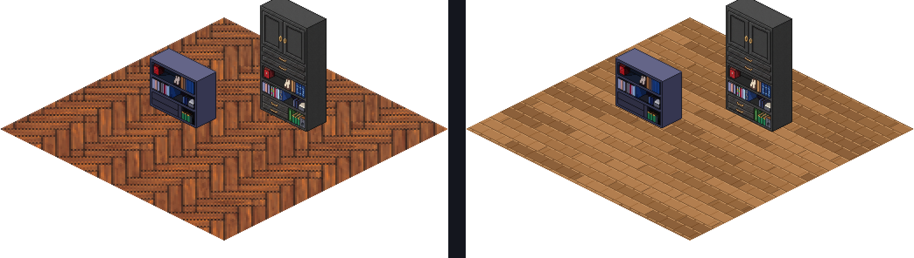
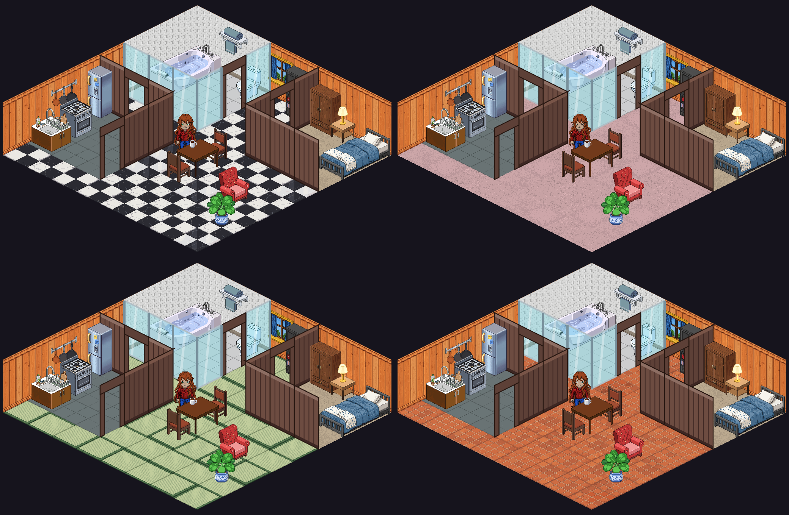
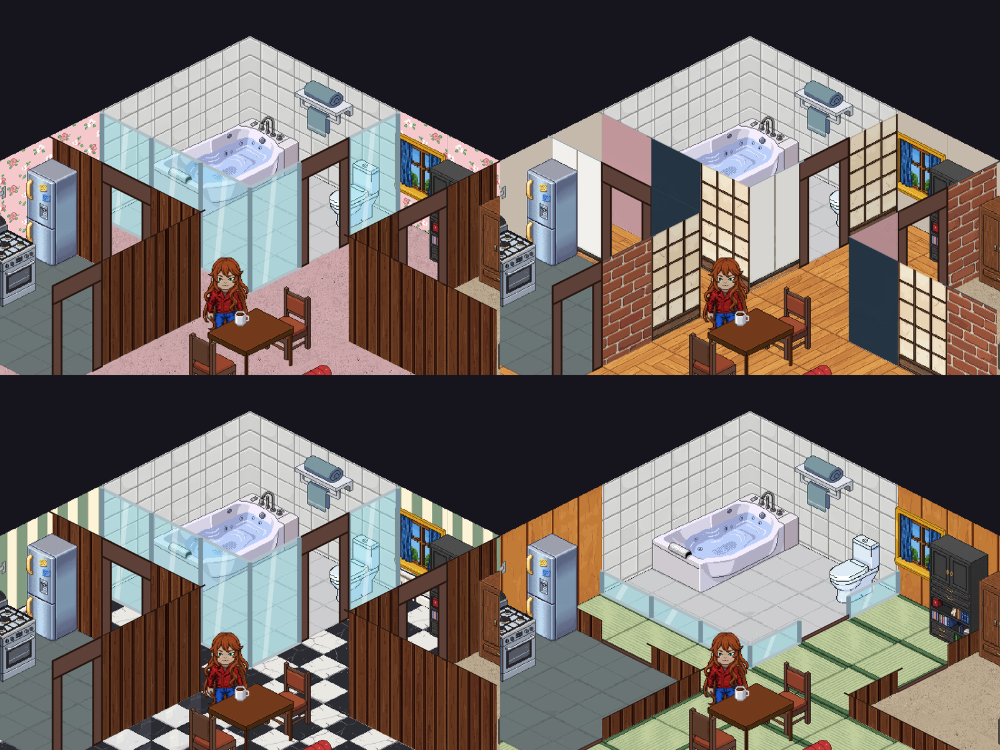
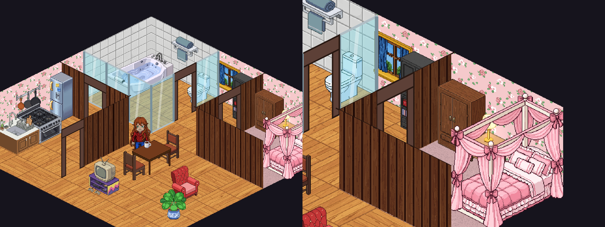
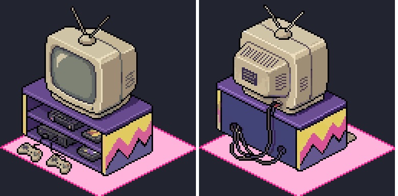
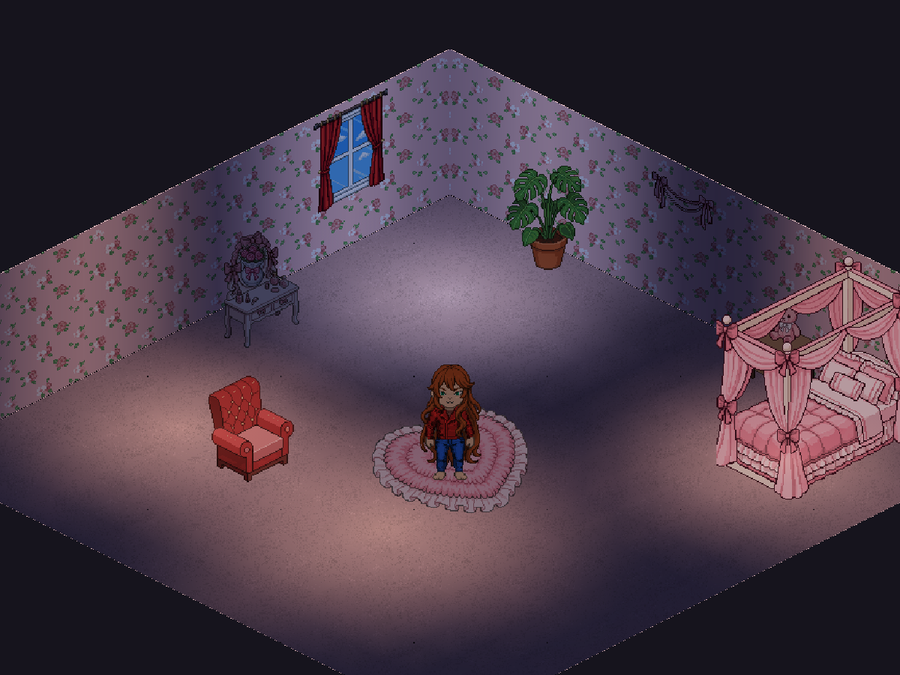
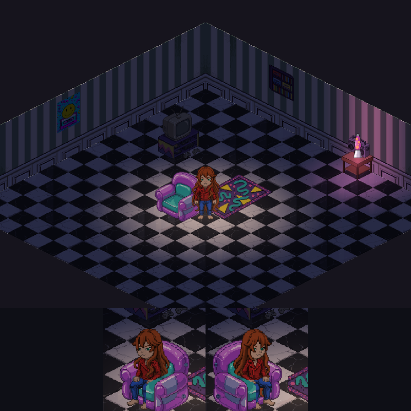
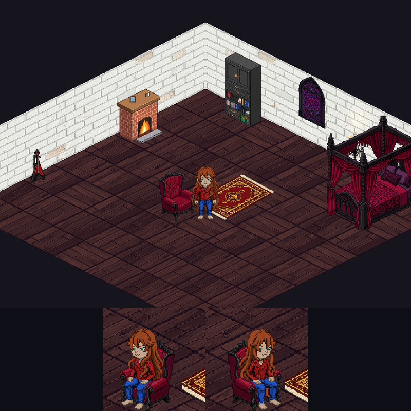

# Plan: Arte del cuarto por estilo (pisos, paredes y muebles)

Objetivo: que el cuarto del jugador pueda vestirse con los mismos estilos que las tarjetas (Metal,
Rústico, Coquette, Café, Arcade, Místico, Matcha, Retro 90s, Monocromo, Costa), y que pisos y
paredes tengan **el mismo tamaño de píxel que los muebles y el avatar**. Con eso, más adelante, el
cuarto podría usarse como escenario de la tarjeta (la antigua fase 7 de
`profile-card-fullscreen-plan.md`, ahora en pausa).

## 0. Diagnóstico (2026-10-09)

Medido en el código (`cozy_room_game.dart`, `isometric_furniture_component.dart`):

| Elemento | Cómo se dibuja | Tamaño de un píxel en el mundo |
|---|---|---|
| Muebles | sprites de 128 px por casilla, dibujados a 0,5× | **0,5 unidades** (casilla = 64 × 32) |
| Avatar | sprite de 64 × 128 en 30 × 60 unidades | ~0,47 unidades |
| Piso | **una** textura de 256 × 256 estirada sobre todo el piso (8 × 8 casillas) y deformada a isométrico | 1 unidad en cada eje: un rombo de **2 × 1**, el doble de ancho que un píxel de mueble y rotado |
| Paredes | una textura de 256 × 256 estirada a 256 × 70 unidades | 1 unidad de ancho × **0,27** de alto: píxeles aplastados casi 4 veces |

Las texturas, además, tienen detalle de 1 píxel (vetas, ruido, mármol). Al deformarlas se ven como
foto, no como pixel art, y nunca pueden calzar con la grilla de los muebles.

A la izquierda, el piso de parquet actual con dos estanterías existentes. A la derecha, un prototipo
del mismo cuarto con el piso dibujado píxel a píxel en la pantalla, a 0,5 unidades por píxel: ahora
calza con los muebles.

**Muebles por estilo:** hay 89 muebles base, casi todos genéricos (cocina, baño, dormitorio, salón).
Algunos estilos tienen piezas (Arcade: escritorio gamer, silla gamer, TV, pósters; Café: cafetera,
taza, libros; Matcha: set de té, tatami, mat de yoga). Coquette, Místico, Costa, Monocromo y Metal
casi no tienen nada propio (ver la matriz en §2).

## 1. Decisiones (confirmadas 2026-10-09: pisos y paredes primero, hechos con PixelLab)

| Tema | Propuesta |
|---|---|
| Pisos | **Baldosas isométricas prerenderizadas**: un sprite de 128 × 64 px por casilla (la casilla de 64 × 32 a 0,5×), con 3 o 4 variantes por material, elegidas por casilla con un hash fijo para que no se note la repetición. Se dibujan casilla por casilla en vez de una textura estirada. |
| Paredes | **Paneles prerenderizados por columna**: cada panel de pared mide 32 × 70 unidades, o sea 64 × 140 px, inclinado como paralelogramo isométrico (sube 1 px cada 2). Hay una versión para la pared norte y su espejo para la oeste, y lo mismo para las paredes interiores (`isometric_interior_wall_component.dart`). |
| Cómo se hacen pisos y paredes | **PixelLab** (decisión del usuario, en vez de procedural). Pisos con `create-tiles-pro` (`tile_type: isometric`, `tile_size: 128`, `tile_height: 64`, `tile_view_angle: 30`, `outline_mode: segmentation`): una llamada da 10 baldosas de 128 × 64 a la densidad exacta, por ~15 generaciones. Se eligen las variantes que calzan entre sí. |
| Colores lisos | Se mantienen como hoy: una base en gris con matiz (`modulate`), ahora también por baldosa o panel. |
| Muebles nuevos | **PixelLab con un mueble existente como referencia de estilo**, en las 4 rotaciones que usa el cuarto y con los tamaños de lienzo del catálogo (128 × 128 para 1 × 1, 192 × 144 para 1 × 2, etc.). Después, contorno selectivo (`convert_selout.py --scenery`), `sync_furniture_assets.py` y `pubspec.yaml`, como siempre. |
| Paquetes por estilo | Cada estilo de tarjeta tiene un **paquete de cuarto**: piso, papel mural y unos 8 muebles. El cuarto inicial que se arma desde los gustos (`generateStarterRoomConfig`) usa el paquete del estilo sugerido. En "Decorar", un filtro por estilo. |
| Orden | Primero pisos y paredes, porque arreglan todos los cuartos de una vez. Después muebles, empezando por un piloto de 2 estilos para medir costo y calidad. |

## 2. Matriz de muebles por estilo

✓ = ya existe (puede necesitar una variante de color). Lo demás está por hacer. Unos 8 muebles por
estilo; la lista es un punto de partida para ajustar contigo.

| Estilo | Piso / pared | Ya hay | Faltan |
|---|---|---|---|
| Metal / Goth | piedra oscura / ladrillo oscuro o damasco | ✓ chimenea, ✓ estantería alta, ✓ armario | candelabro de pie, sillón de terciopelo, cama con dosel negra, vitral (pared), alfombra roja, soporte de guitarra eléctrica |
| Rústico | tablones / troncos | ✓ chimenea, ✓ mesa rústica, ✓ sillón, ✓ monstera, ✓ cama de perro | cama de troncos, farol, leña apilada, alfombra escocesa, cabeza de ciervo de peluche (pared) |
| Coquette | alfombra rosa / rayas rosadas | — | cama con dosel rosa, tocador con espejo, sillón rosado, alfombra de corazón, moños (pared), florero, peluches |
| Café | madera oscura / ladrillo | ✓ cafetera, ✓ taza, ✓ libro, ✓ estantería | barra de café, mesa bistró, lámpara colgante, pizarra con menú (pared), sacos de café |
| Arcade | grilla neón / panel oscuro | ✓ escritorio gamer, ✓ silla gamer, ✓ TV, ✓ pósters, ✓ lámpara de lava | máquina arcade, letrero neón (pared), puf, repisa de consolas, cama con luces LED |
| Místico | alfombra morada con runas / estrellas ✓ | ✓ papel estrellado | mesa con bola de cristal, estante de pociones, caldero, tapiz de luna (pared), velas de pie, hierbas colgadas |
| Matcha | tatami ✓ / shoji ✓ | ✓ set de té, ✓ tatami, ✓ yoga, ✓ shoji (pared interior) | mesa baja, futón, bonsái, farol de papel, cojines zabuton |
| Retro 90s | damero morado y turquesa / Memphis | ✓ lámpara de lava, ✓ juegos de mesa | tele de tubo con consola, radiocasete, puf inflable, repisa de casetes, pósters noventeros, alfombra Memphis |
| Monocromo | concreto / yeso blanco | — | cama minimalista, sofá negro, lámpara de arco, cuadro en blanco y negro, mesa de vidrio |
| Costa | tablones claros / madera blanca | — | hamaca, tabla de surf (pared), silla de ratán, salvavidas (pared), conchas (superficie), alfombra a rayas azules |

En total son unos 55 muebles nuevos, más 10 pisos y 10 papeles murales.

## 3. Fases

Cada fase deja el cuarto funcionando, con `flutter test` y `flutter analyze` sin errores nuevos.

### Fase 1 — Pisos a la densidad de los muebles ✓ (2026-10-09)

- `CreateSprites/room_tiles/make_floors.py`: `--gen <id>` llama a PixelLab y guarda las 10 baldosas
  crudas en `gen/` (como `make_scenes.py`); `--sheet` arma una hoja de contacto con un piso de 4 × 4;
  `--build id=gen[:i,j,...]` recorta cada baldosa al rombo de 128 × 64 y la copia a
  `frontend/assets/images/floors/tiles/<id>_v<n>.png`, y reescribe `tiles.json` (cuántas variantes
  tiene cada id). Las bases grises (`solid_tiles`, `solid_carpet`) se pasan a gris neutro con el
  mismo promedio que las texturas viejas, así los colores lisos se tiñen igual que antes; la
  alfombra pierde el borde que dibuja PixelLab (`drop_edge`) para que no se vea la grilla.
- Elegidas: parquet, nogal y terracota con las 10 variantes; damero con 3 (las únicas con la misma
  fase: arriba y abajo negro, a los lados blanco); tatami con 3 (un tatami entero con borde); baldosa
  gris y alfombra gris con 4 cada una. Costo: 7 llamadas, ~105 generaciones (más 2 de prueba).
- `FloorTiles` (`lobby/utils/floor_tiles.dart`): ruta, manifiesto, `tileKey` (un color liso usa la
  base gris de su textura) y el hash de variante, igual al de Python. `_renderFloor` dibuja casilla
  por casilla, incluidos los reemplazos por zona; si un piso en uso no tiene baldosas, se usa la
  textura estirada de antes. La luz del cuarto sigue encima, sin cambios.
- Tests: `floor_tiles_test.dart` (cada piso del catálogo tiene sus variantes en 128 × 64, tantas como
  dice el manifiesto; colores lisos; hash estable).

### Fase 2 — Paredes a la densidad de los muebles ✓ (2026-10-09)

- `CreateSprites/room_tiles/make_walls.py`: cada papel se genera **plano** (de frente) con
  `generate-image-v2`, con el armario (`closet_rot0.png`) como imagen de estilo para que el píxel
  calce. Dos tipos: `strip`, una tira de 512 × 140 que son los 8 paneles de una pared, continua entre
  paneles (1 imagen por llamada), y `panel`, un panel de 64 × 140 que se repite (shoji, panel blanco;
  4 por llamada). El script corta los paneles y los **inclina corriendo columnas enteras** (la
  columna c baja c // 2 filas): sin reescalar, las líneas horizontales quedan como líneas isométricas
  2:1 de pixel art. Salida: `wallpaper/panels/<id>_p<n>.png` (64 × 172) y `panels.json`.
- La pared oeste dibuja el mismo panel en espejo, así la esquina calza siempre (el panel 0 toca la
  esquina en las dos paredes).
- Las bases grises (`solid_plaster`, `solid_tiles`) se aplanan (se quitan las manchas grandes y queda
  la textura fina) y se llevan al promedio de las texturas viejas, para que los colores se tiñan
  parejo y como antes.
- Generados con semilla 5, todos al primer intento: los 5 papeles, las 2 bases y 4 estilos de muro
  interior (listones, ladrillo, shoji, panel blanco). Costo: 11 llamadas, ~145 generaciones.
- `WallPanels` (`lobby/utils/wall_panels.dart`): manifiesto, `wallpaperKey`, `interiorKey` (vidrio y
  marco de puerta no tienen cara: siguen en vectores) y `draw` (con espejo). `_renderWalls` dibuja
  panel por panel con los reemplazos `n,x` / `w,y`; la luz de las paredes sigue encima, igual que antes.
  Los muros interiores pintan la cara con el panel de su columna, recortada al contorno del muro, así
  la altura de 68 y el modo zócalo (14) muestran la parte de abajo del panel; la tapa superior y los
  marcos de puerta siguen siendo vectores. El mapa de paneles vive en `CozyRoomGame.wallPanels`.
- Si un papel en uso no tiene paneles, se usa la textura estirada de antes (paredes) o los vectores
  (muros interiores).
- Tests: `wall_panels_test.dart` (cada papel y estilo interior tiene sus paneles de 64 × 172, tantos
  como dice el manifiesto; claves de colores lisos, vidrio y puertas).

### Fase 3 — Piloto de muebles con PixelLab (Coquette y Retro 90s)

**Antes del piloto (2026-10-09):** auditoría de los 62 muebles existentes y tres tandas de arreglos
(`docs/furniture-audit.md`), por decisión del usuario: mejor arreglar la base antes de sumar estilos,
porque los muebles nuevos toman a los existentes como referencia.

**Piloto: 2 piezas ✓ (2026-10-09)** con `CreateSprites/furniture_gen/make_furniture.py`:

1. `--genimg`: candidatas del mueble nuevo (`generate-image-v2`, un mueble del catálogo como imagen de
   estilo para que el píxel calce). Se elige una: da el **aspecto**.
2. Maqueta en Python con la **huella exacta** (cajas, cilindros o la cama con dosel) en el lienzo del
   catálogo, en vista frontal y trasera.
3. `--genref`: `edit-images-v2` (`edit_with_reference`) pinta la maqueta con el aspecto elegido.
   Para muebles asimétricos cada vista lleva **su propia referencia** (una candidata frontal y otra
   vista desde atrás, generada con la frontal como estilo); con una sola referencia, PixelLab la copia
   también en la vista trasera. Lienzos de más de 128 px admiten una imagen por llamada; si las dos
   vistas comparten referencia, van lado a lado en una sola imagen.
4. `--build`: contorno selectivo, rot1/rot3 en espejo, `established_furniture/` y `new_added/`, y la
   entrada del catálogo (`furniture_catalog.json`).

| Pieza | Estilo | Resultado |
|---|---|---|
| `canopy_bed` (Cama con Dosel, 1×2) | Coquette | cama blanca de cuatro postes con cortinas rosadas, moños y volados. Lienzo de 192 × 240 (offset −64, −84) para el dosel. **Solo decoración** (no se puede acostar: `BedSleepConfig` no la conoce) y rot2 = rot0: pedida desde la cabecera, PixelLab siguió dibujando la vista desde los pies; la vista trasera real se hace con el arte para acostarse, que es por vista. |
| `crt_tv_console` (Tele de Tubo con Consola, 1×1) | Retro 90s | tele beige con antena sobre un mueble morado con zigzag Memphis, consolas y controles; vista trasera con el tubo, rejillas y cables. |

Costo: 95 generaciones las dos (incluido el intento fallido de la vista trasera de la cama). Para
producir en serie: ~15–20 por las candidatas frontales, ~15–20 por las traseras (solo asimétricos) y
~5–10 por la pintura de la maqueta, o sea **~30–50 por mueble**: los ~55 muebles de la matriz caben en
un mes del plan (7.833).

Pendiente: las entradas nuevas del catálogo se agregaron a mano. `sync_furniture_assets.py` agregaría
como muebles las capas `_seated` del inodoro (no las reconoce como capas), así que no se corrió.

### Fase 4 — Los otros estilos

- Mismo proceso, un estilo por tanda, revisando cada uno contigo antes de sincronizarlo.
  `make_furniture.py --catalog <ids>` escribe las entradas nuevas del catálogo (formato del sync).
- Ids que contienen `rug` son alfombras (`CozyRoomGame.furnitureTypeFor`): se camina encima y quedan
  bajo los muebles. El juego ya sabía tratarlas, pero nada les asignaba ese tipo.

**Coquette ✓ (2026-10-10):** `vanity_table` (Tocador con Espejo, vista trasera propia),
`heart_rug` (Alfombra Corazón 2×2, simétrica: el corazón queda derecho en toda rotación; la maqueta se
desbordaba con `edit_with_reference`, así que se usa la candidata centrada), `flower_vase_pink` y
`plush_teddy` (superficie), `wall_bow_garland` (pared), más `canopy_bed` del piloto. Todo con la
cama con dosel como imagen de estilo. Pendiente: el **sillón rosado**: los asientos necesitan capas
`_front` por rotación (el avatar se sienta entre la base y el frente), que este proceso aún no genera.
Costo: ~110 generaciones.

**Retro 90s ✓ (2026-10-10):** `inflatable_chair` (Sillón Inflable, asiento), `boombox_radio`
(Radiocasete, superficie), `memphis_rug` (Alfombra Memphis 2×2), `wall_cassette_rack` (Repisa de
Casetes) y `wall_poster_90s` (Póster Noventero), más `crt_tv_console` del piloto y la lámpara de lava
que ya existía. Todo con la tele de tubo como imagen de estilo.

- **Asientos:** `kind: "shape"` usa como maqueta la silueta de un asiento existente (aquí
  `plush_armchair`), así que sirven sus puntos de asiento (registrados en `chair_seat_config.dart`, con
  el inflable 4 unidades más a la derecha en rot 0/1) y su capa `_front`: en rot 0/1 son los píxeles
  nuevos bajo el apoyabrazos del original (extendidos hacia abajo en esas columnas); en rot 2/3, el
  sprite completo (el respaldo tapa al avatar). Para que el juego lo trate como asiento, el id debe
  contener `chair`, `sofa`, `couch` o `toilet`.
- **Pósters:** con el quitafondos el papel desaparecía (como el mapa de la tanda 3). Las piezas con
  `"opaque": True` se generan sin quitar el fondo, con el póster llenando la imagen.
- Las alfombras salen más chicas que su 2×2 (la de corazón también): son caminables, así que solo
  afecta dónde se pueden soltar. Se puede regenerar más grandes si molesta.

Costo: ~80 generaciones según el saldo.

**Metal / Goth ✓ (2026-10-10):** `velvet_armchair` (Sillón de Terciopelo, asiento sobre la silueta
del sillón, mismos puntos de asiento), `gothic_canopy_bed` (Cama con Dosel Gótica, decoración como la
Coquette), `candelabra_floor_sm` (Candelabro de Pie, emite luz cálida que titila),
`electric_guitar_stand_sm` (Guitarra Eléctrica), `red_velvet_rug` (Alfombra Roja) y
`stained_glass_window` (Vitral Gótico, deja entrar luz de día violácea), más la chimenea y las
estanterías que ya había. Luces nuevas en `EmitterLightSpec` (por prefijo de id): `candelabra`,
`stained_glass_window` y, de paso, `crt_tv_console` (como la otra TV, apagada por defecto).

Falta para que el cuarto se vea gótico: un papel mural oscuro (ladrillo oscuro o damasco) y un piso de
piedra oscura; van con los paquetes de estilo (fase 5), junto con los pisos y papeles que la matriz
pide para los demás estilos.

Costo: ~110 generaciones.

### Fase 5 — Paquetes de cuarto por estilo

- `RoomStylePack` (piso, pared, muebles y una disposición sugerida) para cada id de tema de tarjeta.
- `generateStarterRoomConfig` arma el cuarto inicial con el paquete del estilo sugerido por los
  gustos (`ProfileCardStyle.suggestedTheme`).
- En "Decorar", un filtro "Estilo" y la opción de aplicar el paquete completo.
- Tests: cada estilo tiene su paquete y todos sus ids existen en el catálogo.

### Después — "Mi cuarto" como escenario de la tarjeta

Con el cuarto ya coherente se retoma la fase 7 del plan de la tarjeta (el cuarto del jugador detrás
de su avatar).

## 4. Riesgos

- **Rotaciones inconsistentes en PixelLab:** que las 4 vistas no sean el mismo mueble. Por eso el
  piloto, y regenerar solo la rotación mala con otra semilla, como con el pelo.
- **Iluminación:** las luces del cuarto se calculan sobre el piso y las paredes actuales. Hay que
  revisar que sigan bien con baldosas y paneles.
- **Rendimiento:** son 64 baldosas y 16 paneles en vez de 3 texturas. Son sprites chicos y se
  pueden prerenderizar a una sola imagen cuando cambia el cuarto (en Flame, a un `Picture` o
  `Image` en caché).
- **Cuartos guardados:** los ids de piso y pared no cambian, solo su arte, así que los cuartos
  existentes se ven con el arte nuevo sin migrar nada.
